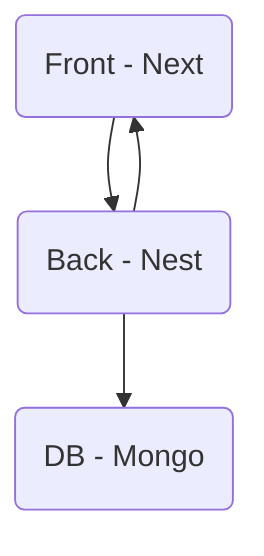

# Welcome to Candidator

## What is it ?

This project is orignally a fork of Naboo Interview project.

You can find the original [readme.legacy.md](readme.legacy.md) at the root project, listing all the technologies used.

## Project structure 

Initially it was divided in two subprojects :

- Frontend (containing source and configurations)
- Backend (containing source and configurations)

#### What's new

Moved from two projects to two NPM workspaces `front-end` and `back-end` (https://docs.npmjs.com/cli/v7/using-npm/workspaces for more infos)

Why ? Because as both use `Node.js` ecosystem and `npm` to manage their dependencies, it'll be easier to maitain versions between the two applications. We also centralized all configurations (eslint, prettier, tsconfig) and make all sub-conf extends them, in order to have same code rules in the whole project.


 Also created a `core` workspace for common utilities or model they could use (TODO: maybe move all the GraphQL part inside it).

## Project architecture

A classic web-app structure :



## Tools

To run this project you will need :
- `Node.JS` (version >= 20.4.0) and `npm`
- `MongoDB` (running locally or inside a docker container)
- `docker` and `docker-compose` since we added it

## Installation

You can install all the dependencies of the project by running `npm install` at the root of the project. It will install in the root `node_modules` all common dependencies, and optionally install in workspaces specific modules.

## Run
##### BEFORE ANYTHING

Do not forget to run locally your mongoDB.

In the `backend`, also copy `.env.dist` to `.env` and specify your DB name

##### Back

WARNING: backend need the DB to fully init

You can run the back by using the command

```bash
npm run dev:back
```

##### Front

WARNING: frontend need the backend to fully init

Make sure you've run the command `npm run front:generate-types` before anything

You can run the front by using the command

```bash
npm run dev:front
```

## With docker compose

Since we added a `dockerfile` and a `docker-compose.yml` to industrialize our app, you can also run three distinct containers by running the command : 

```bash
docker compose up
```

or with rebuild of images (after any changes) :

```bash
docker compose up --build
```

or specify the service you want up 

```bash
docker compose up <name>
```

To stop container :

```bash
docker compose stop <name>
```

To delete container :

```bash
docker compose down <name>
```

It allows you to run the DB in a container if you don't want a local MongoDB server for example.

#### NOTES ABOUT DOCKER

We use the docker context and stages to build separatly the front and the back tho it's all in the same dockerfile as they need to share files (back -> front).

It could be optimized by adding a global builder installing all dependencies once, and using npm CI to install only required packages from `package-lock.json`

Could be henanced also with fast refresh in dev mode by mounting volumes ?

</br>
</br>
</br>
</br>
</br>
</br>
</br>
</br>
</br>
</br>
</br>
</br>


#### How to

This section aim to give advices about little problems we encountered in the project, to accelerate resolution time for next devs.

##### React config for vitest

You can encounter a type error in the `vitest.config.ts` file. It's due to multiple vite dependency installed via npm, since we're in monorepo it can happen, you can resolve it by running the commmand :

```bash
npm dedupe
```

This will resolve duplicates in your dependency tree